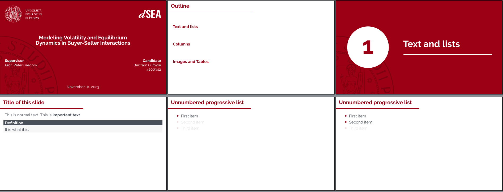

<!--
// ┌───────────────────────────────────────────────────────────────┐
// │ Contents of README.md                                         │
// ├───────────────────────────────────────────────────────────────┘
// │
// ├──┐Masterthesis
// │  ├── Final results
// │  ├── Requirements
// │  ├── PDF generation
// │  ├── Content editing
// │  └──┐File structure
// │     ├── Thesis
// │     ├── Presentation
// │     └── Other files
// │
// └───────────────────────────────────────────────────────────────
-->

# Masterthesis

An elegant [LaTeX](https://www.latex-project.org/) template for your thesis and presentation.

## Final results

Sane typesetting defaults, drop caps and a touch of color make the reading more enjoyable, both on screens and paper:

<p align="middle">
  
  
</p>  

Ideal for every major:


  
The simplicity of the accompanying presentation will keep the audience focused:



Find example PDFs inside the [example](/example) folder.

## Requirements

To use this template, you will need:

- a LaTeX distribution such as [MiKTeX](https://miktex.org/) (for Windows), [MacTeX](https://tug.org/mactex/) (for MacOS), or [TeXLive](https://tug.org/texlive/) (for Linux)
- a LaTeX or code editor, like [TeXStudio](https://www.texstudio.org/) or [VSCodium](https://vscodium.com/)
- a reference manager like [Jabref](https://www.jabref.org/)
- [`make`](https://www.gnu.org/software/make/manual/make.html) to start compilation workflows ([Windows installation steps](https://stackoverflow.com/a/32127632))

Once you installed them, clone this repo or extract its [.zip archive](https://github.com/AlphaJack/masterthesis/archive/refs/heads/master.zip).

## PDF generation

There are two ways to generate PDFs:

- using your editor's "build" features (make sure it is using LuaLaTeX instead of PDFLaTeX)
- running `make` from the terminal

Here is  a list of the most useful `make` commands that you can run from your terminal:

```bash
 # generate covers
make cover

 # generate thesis
make thesis

 # generate presentation
make presentation

 # deletes temporary files
make clean
```

## Content editing

To understand how to write a thesis document using the template, read [USAGE-THESIS.md](/USAGE-THESIS.md).
If you also need to prepare an accompanying slideshow, read [USAGE-PRESENTATION.md](/USAGE-PRESENTATION.md)

## File structure

### Thesis

These files can be used to generate `thesis.pdf`

```bash
├── chapters/                       # folder for structured document content
│   └── 1.tex                       #     content of first chapter
├── pages/                          # folder for single pages, lists, references and variables
│   ├── abstract.tex                #     brief introduction to the research
│   ├── acknowledgements.tex        #     people that have professionally helped and supported you
│   ├── acronyms.tex                #     list of acronyms
│   ├── bibliography.tex            #     layout of bibliography
│   ├── colophon.tex                #     notes about typesetting
│   ├── committee.tex               #     empty page for signatures
│   ├── copyright.tex               #     simple copyright notice
│   ├── cover-digital.pdf           #     colorful first and last page of the final document
│   ├── dedication.tex              #     dedication to someone special
│   ├── lists.tex                   #     layout of content, list of figures, list of tables, etc.
│   ├── placeholder.tex             #     standard placeholder text
│   └── title.tex                   #     layout of title page
├── pictures/                       # folder for pictures and covers
├── masterthesis.cls                # layout of the thesis document
├── references.bib                  # biblatex database of bibliographical references
├── thesis.tex                      # main structure of the thesis document
└── variables.tex                   # contains variables such as university, author, title, logo files, etc.
```

### Presentation

These files are used to generate `presentation.pdf`

```bash
├── chapters/                       # folder for structured document content
│   └── slides.tex                  #     content of slides
├── beamerthememasterthesis.sty     # layout of presentation
├── presentation.tex                # main structure of the presentation
├── references.bib                  # biblatex database of bibliographical references
└── variables.tex                   # contains variables such as university, author, title, logo 
```

### Other files

Other files and their purpose:

```bash
├── examples/                       # folder containing example PDF outputs
├── extra/                          # folder for files that generate other PDFs
│   ├── cover-digital.tex           #     layout of cover for digital reading in thesis.pdf
│   ├── part.tex                    #     quickly compile a part of the content
│   ├── cover-printed.tex           #     layout of front cover for relief printing in a copy shop
│   └── cover-printed-spine.tex     #     layout of cover spine for relief printing in a copy shop
├── .gitignore                      # prevents git from saving temporary files
├── .hidden                         # prevents many linux file managers from showing temporary files
├── LICENSE                         # license file
├── Makefile                        # allows to build the thesis via `make` commands
├── README.md                       # explain objective
├── USAGE-PRESENTATION.md           # explain usage of presentation
└── USAGE-THESIS.md                 # explain usage of thesis
```

### Showcase

List of friends that used this template for their theses:

- Giacomo Coletto (2023), [The Impact of Artificial Intelligence on Strategic and Operational Decision Making](https://hdl.handle.net/20.500.12608/55202), _business administration_
- Federico Roncaglia (2023), [A Calorimetric Loss Measurement for Switching Power Devices](https://hdl.handle.net/20.500.12608/55114), _electronic engineering_
- Riccardo Cazzin (2023), [Soluzione numerica di equazioni integrali di Fredholm su domini poligonali](https://hdl.handle.net/20.500.12608/61297), _mathematics_
- Maggye Rizzante (2024), [Evoluzione delle tecniche di vendita: un’analisi del modello di business di Goppion Caffè S.p.A. e il confronto tra tentata vendita e copia commissione](), _business administration_
